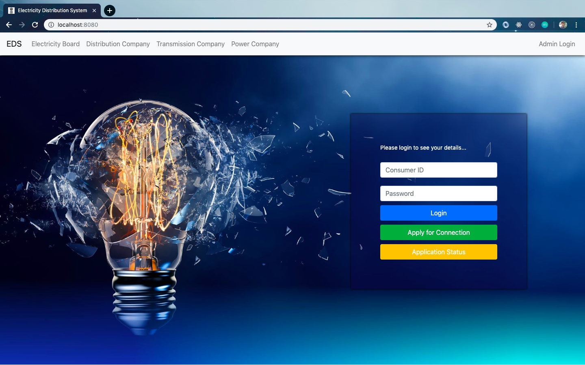
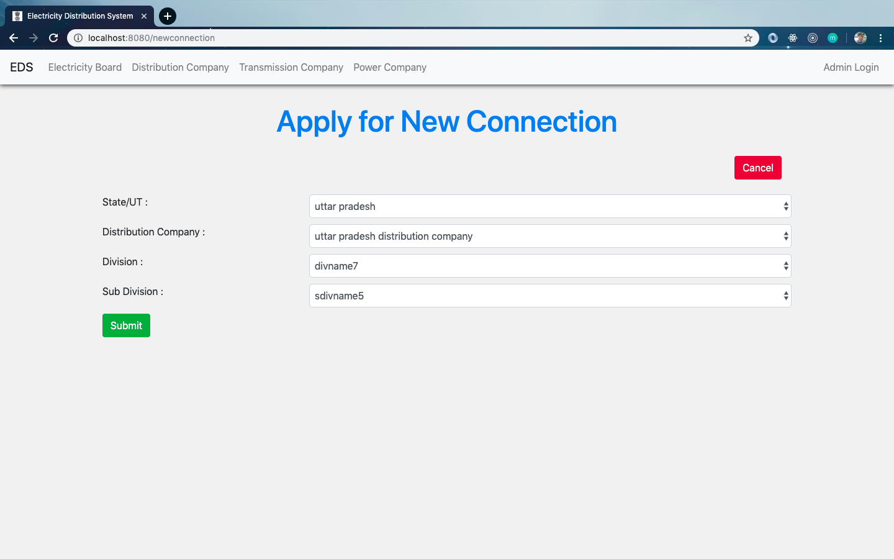
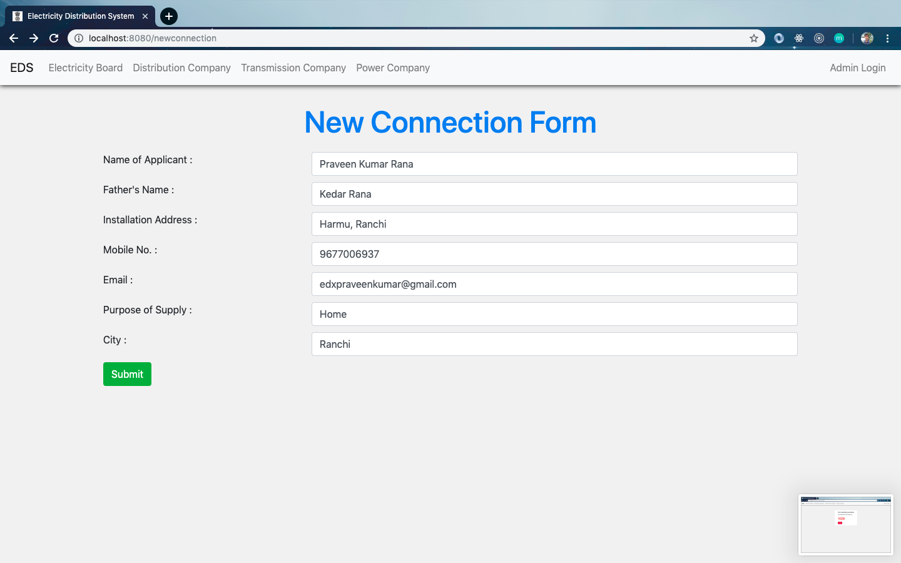
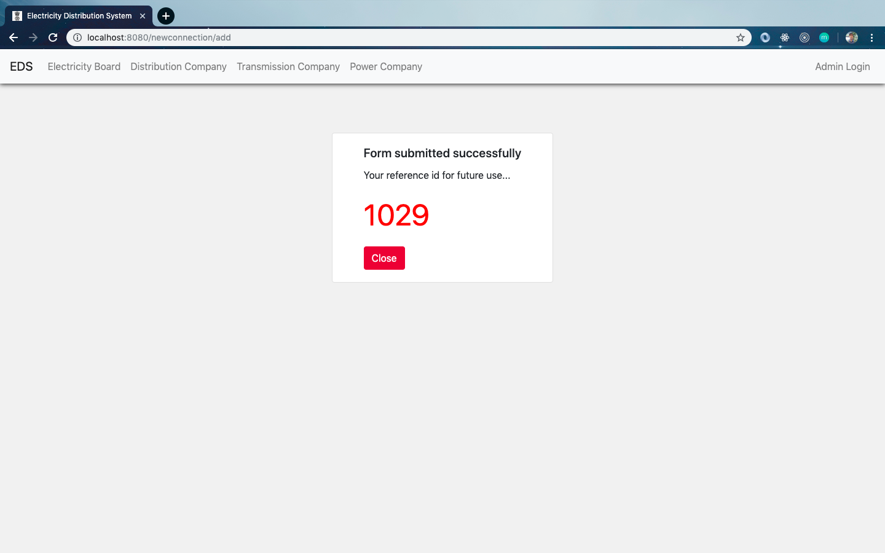

# Electricity Distribution System in India

Build using _NodeJS, Express Framework, Bootstrap v4.0, MySQL Database , HTML and CSS_ for **"My Database Management Course Project"**.

**Language Used**: JavaScript, SQL, and Markup Language.  

## Functionalities Present
### Landing Page

- From here _consumer_ can login and check about his profile and electricity bill details.  
- A new _consumer_ can apply for new connection and if already applied then he can check for the status.  
- On Clicking for Apply connection first Selecting of some information will be taking place and then the form will be displayed.  

### Appy New Connection

