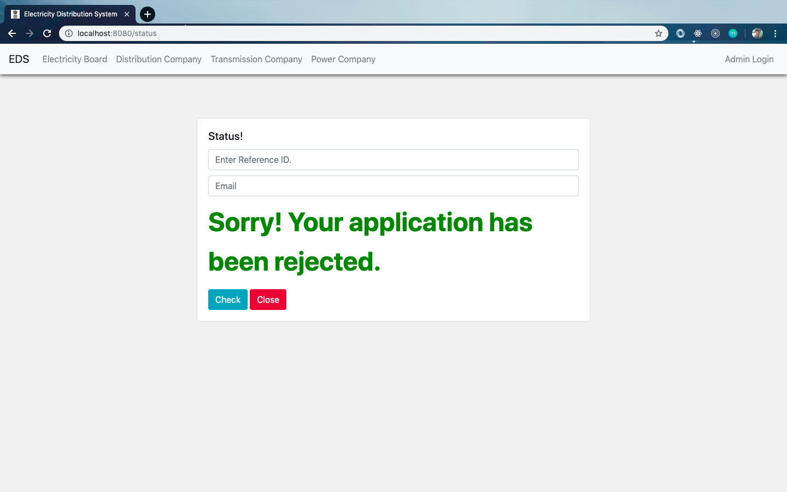
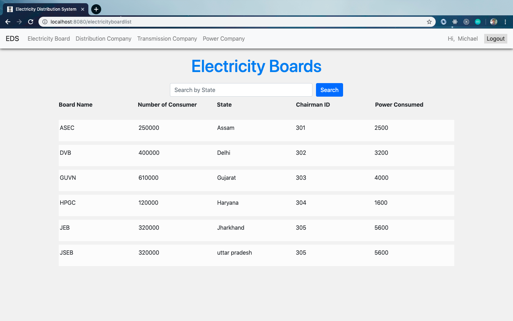
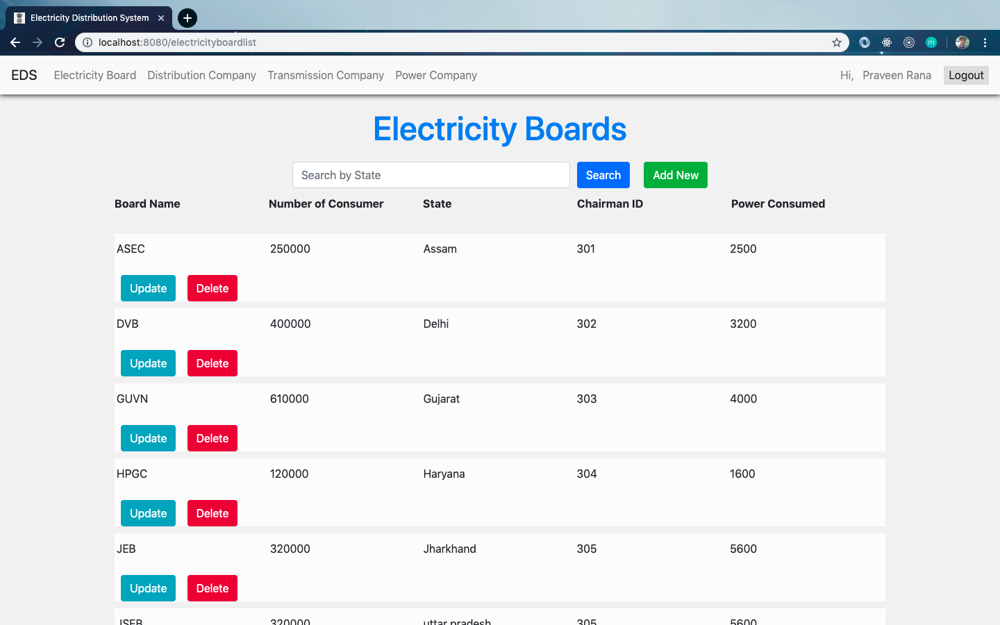
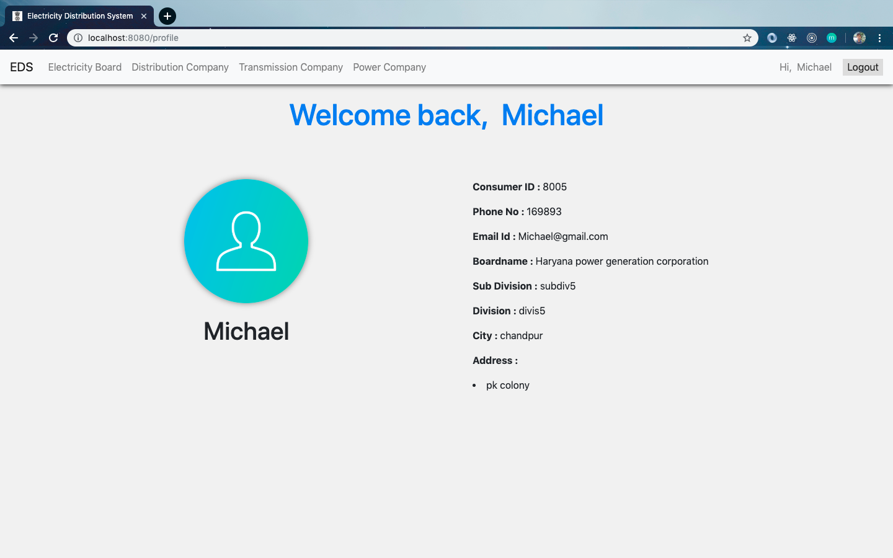
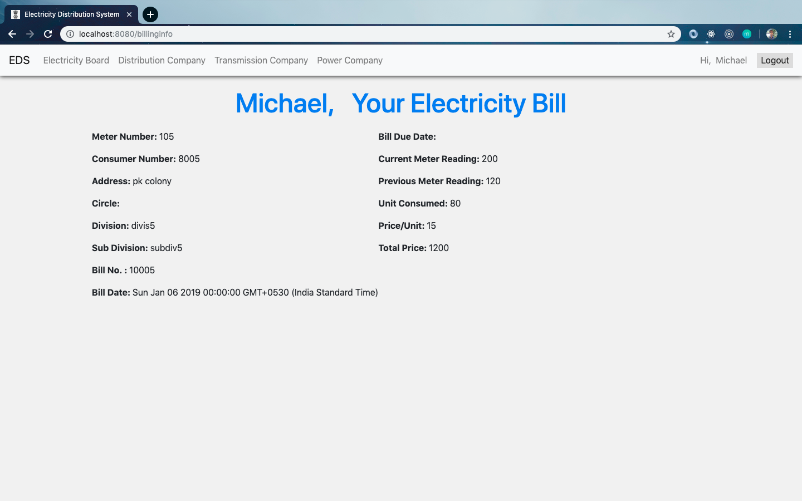

# Electricity Distribution System in India

Build using _NodeJS, Express Framework, Bootstrap v4.0, MySQL Database , HTML and CSS_ for **"My Database Management Course Project"**.

**Language Used**: JavaScript, SQL, and Markup Language.  

## Functionalities Present
### Landing Page

- From here _consumer_ can login and check about his profile and electricity bill details.  
- A new _consumer_ can apply for new connection and if already applied then he can check for the status.  
- On Clicking for Apply connection first Selecting of some information will be taking place and then the form will be displayed.  

### Appy New Connection

- On filling the above form this connection form will appear. And on Successfull Submission Reference Id will be shown.    
   
### Reference Id
   
### Application Status
- This will take email id and reference id as input and show whether the form is accepted or not.    

### Electricity Board List
- In the same way Power Company, Distribution Company and Transmission Company list will be displayed to the general user such as consumer.
- This is the simple list page for people to see that which are the board list are available in there country, where they are etc.

- The search bar will help to search for Name in particular state.
- This data can't be tampered by the common people.
- When the authorized staff will login he/she can update the details/ delete any company which is shut down/ or add any new company.

## Logged In User Profile and Bill Information Page.

